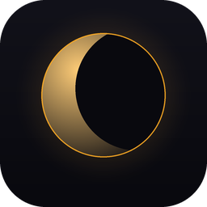

<div align="center">



# Lumen

**Cross-platform display gamma, brightness & color-temperature control.**

Tune how your screen looks — midtone gamma, output brightness and warm/cool
color temperature — with live preview, global hotkeys, a day/night scheduler
and a system tray. Works on Windows, macOS and Linux, on any GPU.

[Download](https://github.com/JirkaachS/Lumen/releases) ·
[Features](#features) ·
[Install](#install) ·
[Build from source](#build-from-source)

</div>

---

## Why Lumen

Lumen is a ground-up rework of a small Windows-only gamma tool. It keeps the
original idea — quickly nudging your display's gamma — and grows it into a
proper cross-platform utility:

- **Three controls, not one.** Gamma (contrast/midtones), brightness (output
  scale) and color temperature (3000–10000K, like Night Light / f.lux).
- **Digital vibrance.** VibranceGUI-style saturation control (0–100%, 50% =
  neutral) for punchier colors — NVIDIA via NVAPI on Windows, `nvidia-settings`
  on Linux.
- **Resolution & refresh-rate switching.** Pick any mode with Default / Stretch
  / Center scaling, with a confirm-or-auto-revert safety net.
- **Per-app game profiles.** Add a process and Lumen auto-applies its vibrance
  (and optionally a resolution) the moment the game launches, then restores your
  desktop when it closes.
- **Live preview.** A gradient bar shows the exact effect before it hits your
  eyes.
- **Presets.** Night, Reading, Normal, Vivid, Gaming and Movie — one click each,
  plus a quick-access copy in the tray menu.
- **Global hotkeys.** Bind keyboard combos *or* mouse buttons (including Mouse
  4/5) to instantly toggle a profile and back.
- **Day / night scheduler.** Automatically switch profiles at the times you set.
- **Launch at startup.** A single toggle (and an installer checkbox) registers
  Lumen to start with your system — per-user, no admin/root needed.
- **Polished UI.** Frameless window, sidebar navigation, a glowing circular
  gamma dial, gradient sliders, smooth animated transitions and five accent
  themes.

## GPU & platform support

Lumen talks to the operating system's gamma-ramp APIs, **not** any vendor SDK,
so it is GPU-agnostic — NVIDIA, AMD and Intel all work the same way.

| Platform | Backend | Notes |
|----------|---------|-------|
| Windows  | GDI `SetDeviceGammaRamp` | Full per-channel ramp. |
| macOS    | CoreGraphics `CGSetDisplayTransferByTable` | Full ramp on Apple Silicon & Intel. |
| Linux    | X11 XRandR (via ctypes), `xrandr` CLI fallback | Full ramp on X11; Wayland uses the fallback where available. |

> Some laptop panels and a few drivers refuse hardware gamma ramps — that is a
> driver limitation. On Windows, running as Administrator can help in those
> cases.

**Vibrance & resolution support:** Digital vibrance needs a vendor color API —
NVIDIA (NVAPI) on Windows and `nvidia-settings` on Linux; AMD and macOS aren't
covered yet and the control hides itself when unavailable. Resolution switching
works on Windows and on Linux (via `xrandr`).

## Install

### Windows
1. Grab `LumenSetup-<version>.exe` from the [Releases](https://github.com/JirkaachS/Lumen/releases) page.
2. Run it. Tick **"Launch Lumen automatically when Windows starts"** if you want autostart.

Or run the portable `Lumen.exe` directly — no installation required.

### macOS
1. Download `Lumen-<version>.dmg`, open it and drag **Lumen** to Applications.
2. First launch: right-click → Open (unsigned build). Enable autostart from
   **Settings → Launch at system startup**.

### Linux
```bash
# from a release tarball or a clone
./installer/linux/install.sh            # install for current user
./installer/linux/install.sh --autostart # install + launch at login
```
Requires an X11 session for full gamma ramps (`libX11`, `libXrandr`). Global
hotkeys need elevated permissions on Linux.

## Usage

- **Control** — pick a display, drag the Gamma / Brightness / Temperature
  sliders, or hit a preset. "Apply to all monitors" (Settings) fans changes out
  to every screen.
- **Hotkeys** — choose Keyboard or Mouse, set the target γ / brightness / K,
  click **Record Hotkey**, then press your combo or click a button. Triggering a
  bound hotkey toggles the profile; trigger it again to return to neutral.
- **Schedule** — turn on day/night and set profiles + times.
- **Settings** — autostart, restore-on-exit, keep-on-top, start-minimized,
  smooth transitions and accent color.

Settings live in:
- Windows `%APPDATA%\Lumen\settings.json`
- macOS `~/Library/Application Support/Lumen/settings.json`
- Linux `~/.config/lumen/settings.json`

## Build from source

```bash
git clone https://github.com/JirkaachS/Lumen
cd Lumen
pip install -r requirements.txt

# run directly
python -m lumen

# build a standalone bundle for the current OS
pip install pyinstaller
python scripts/build.py        # → dist/

# Windows installer (needs Inno Setup)
iscc installer/windows/lumen.iss
```

Tagging a commit `vX.Y.Z` and pushing triggers the GitHub Actions workflow,
which builds Windows / macOS / Linux artifacts and attaches them to a Release.

## License

[MIT](LICENSE) © JirkaachS
